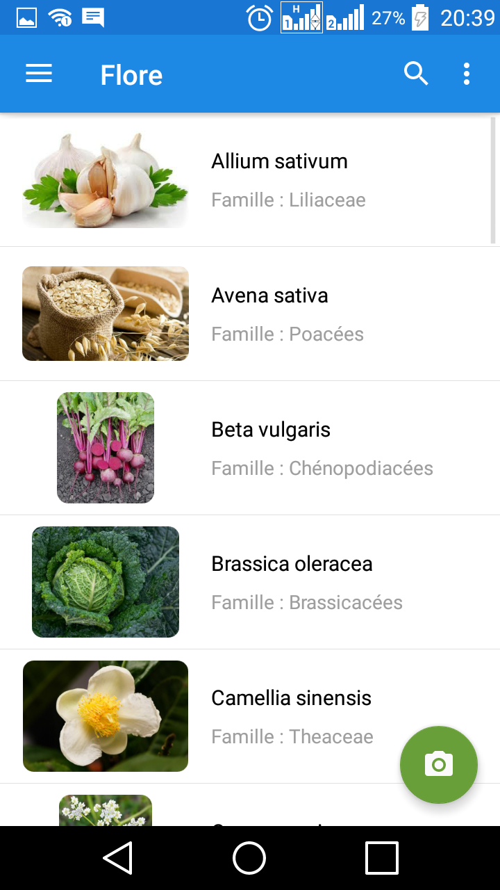
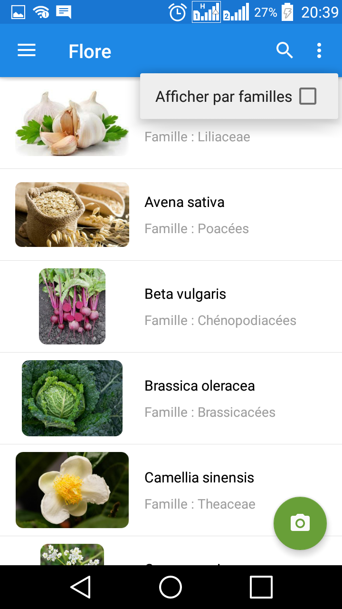
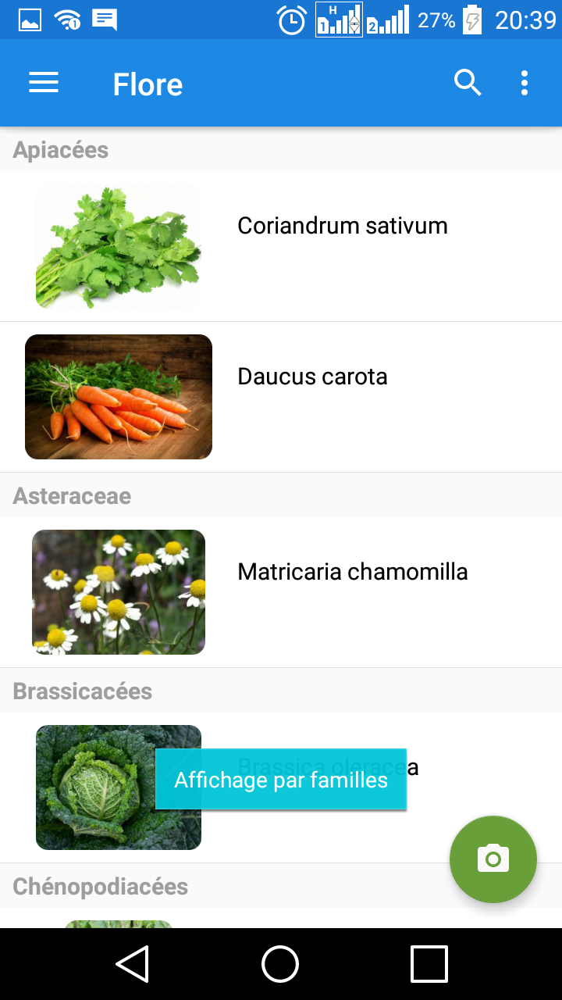
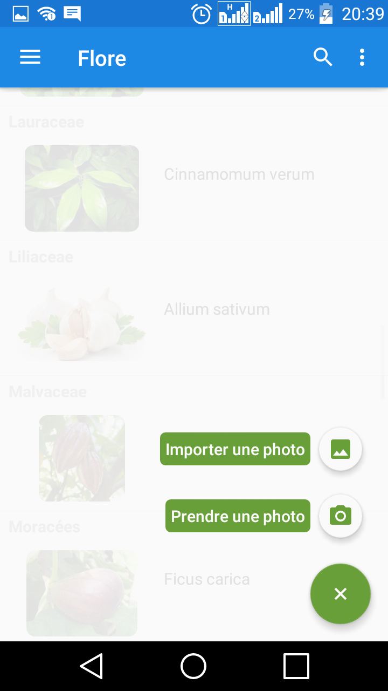
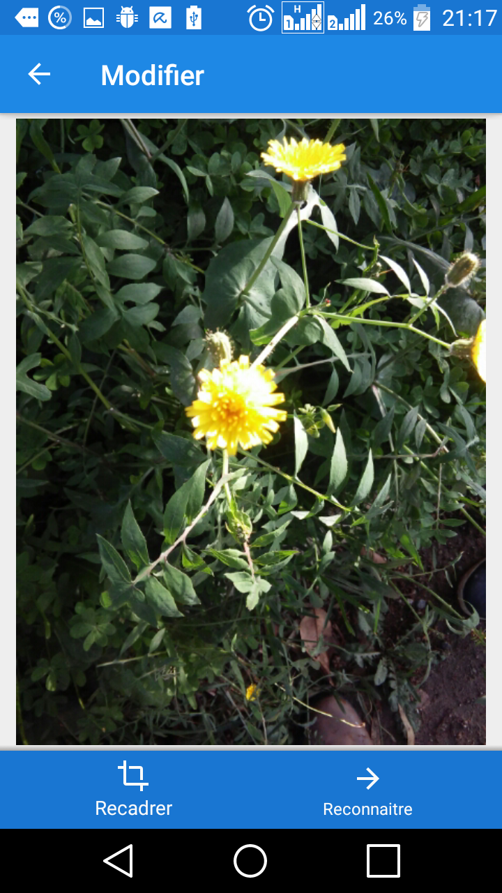
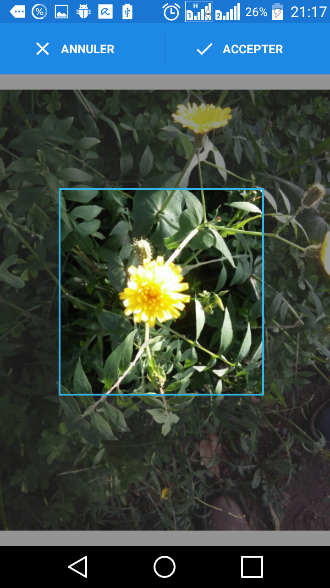
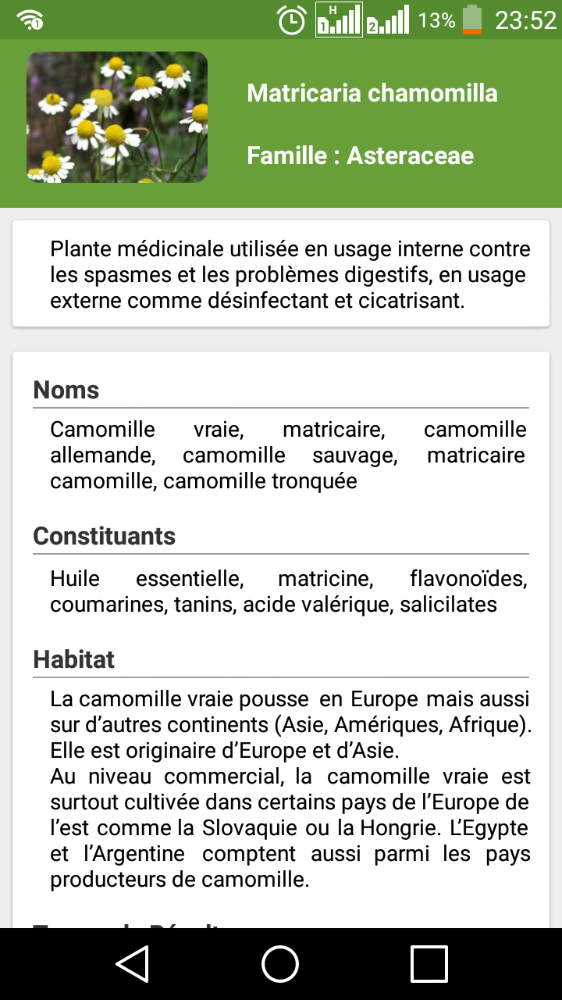
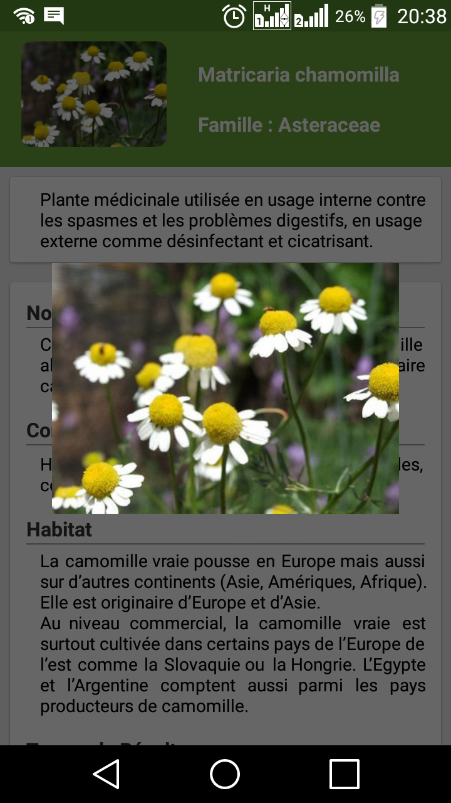
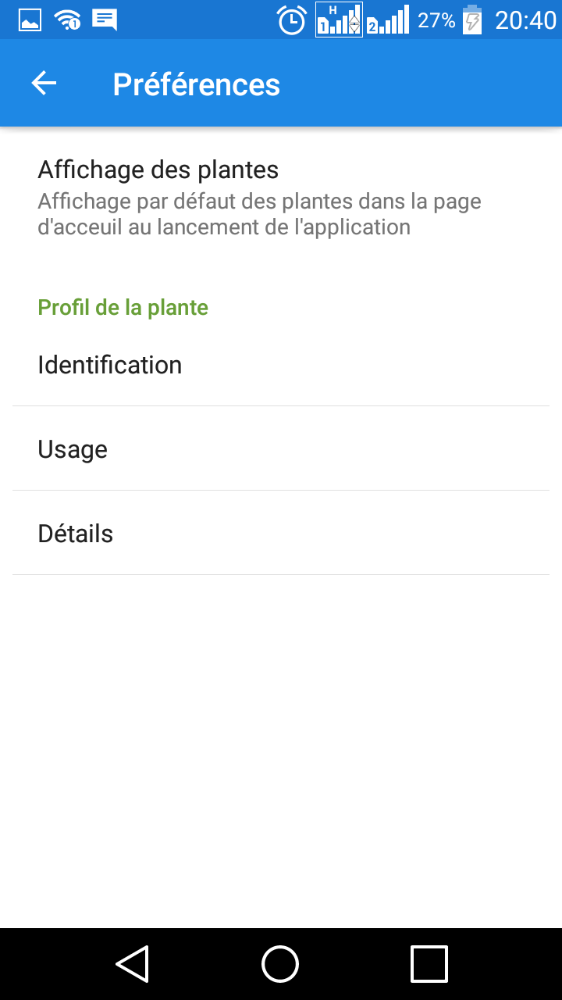
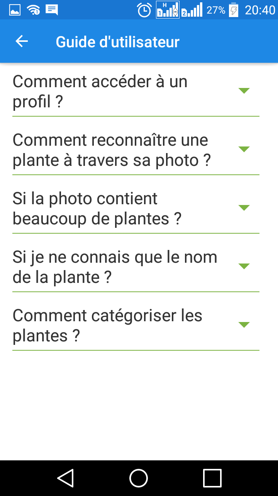

# Flore - Remedy in Nature
             This is the repository of our second year project, 2CPI-TEAM N°1 
# Demo

  
  
  
  
  
  
  
  
  
  
  
  
  
  
  
  
  
  
  
  
  
  

## Setting up the project on github  : 
 1 fork the repository 
 2 clone it using the link or the terminal 
## Setting up the project on Android Studio :
 - first , you must have the following dependencies :
    *  buildToolsVersion "25.0.2"
    *  com.android.support version "25.1.1"
    *  NDK 
    
## Reporting bugs 
all the bugs must be declared in the issues https://github.com/chenineazeddine/Flore/issues 

## Remarks : 
  - if any one had issues with the gradel version follow these instructions :
    1.  File > Settings > Build ,Execution .. > Gradel 
    2.  Select : use default gradle wrapper 

   
          
