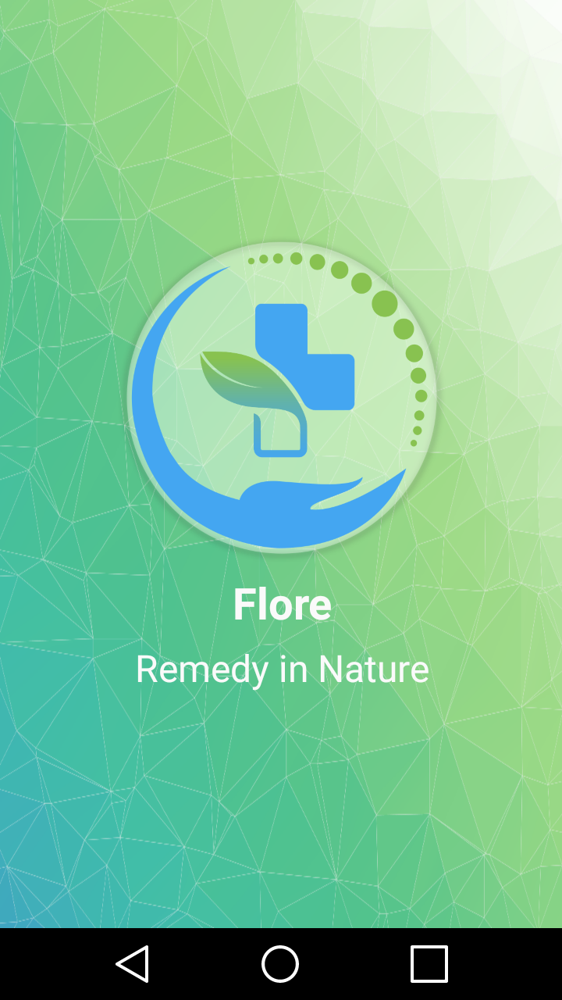

   

  
# Flore - Remedy in Nature
             Android Mobile Application for Medicinal Plants Recognition 
# Demo

  
  
  
  
  
  
  
  
  
  
  
  
  
  
  
  
  
  
  
  
  
  

## Setting up the project on Android Studio :
 - First , you must have the following dependencies :
    *  buildToolsVersion "25.0.2"
    *  com.android.support version "25.1.1"
    *  NDK 
 - Second, import the project using this URL : https://github.com/FloreDz/Flore.git
    
## Reporting bugs 
   - All bugs must be declared in the issues tab : https://github.com/FloreDz/Flore/issues
     
    
## Remarks : 
   - If anyone had issues with the gradel version follow these instructions :
       1.  File > Settings > Build ,Execution .. > Gradle 
       2.  Select : use default gradle wrapper 
       
